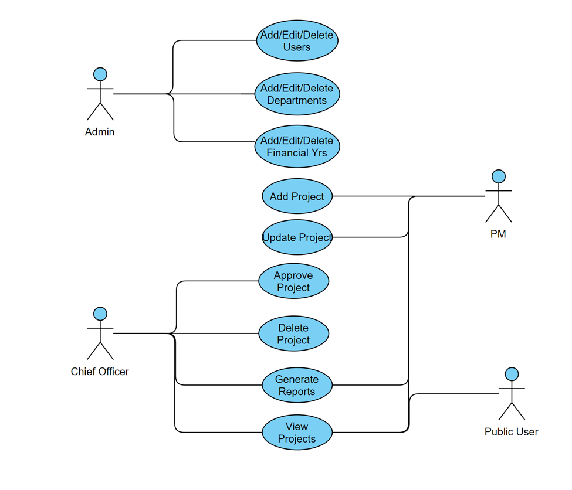
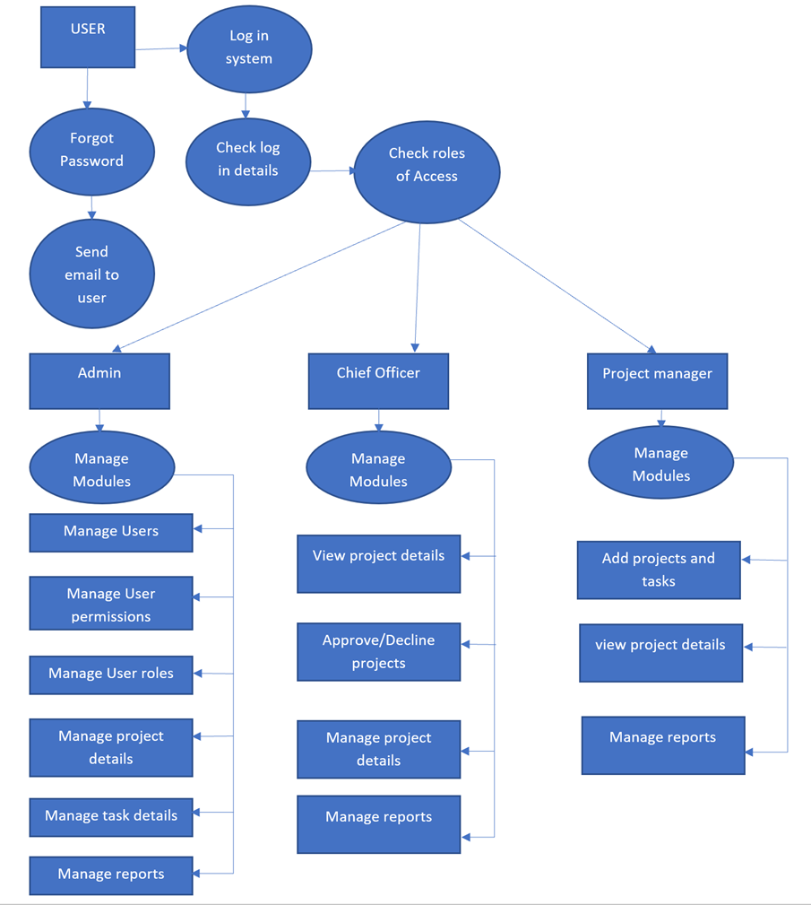

# CPMS 
(County Project Management System)
## Welcome to the County Project Management System

**Authors**: 
1. Eric Kirira Maranga - Lead Developer
2. Stephen Mwangi - Contributor

**Project Title**: County Project Management System

[Live Link]()

**Brief**: This research project aims to develop a secure county government project management system to streamline project execution, 
eliminate human errors, and ensure compliance with government policies, covering project details such as budgets and deadlines.

### Tech Stack (LAMP)
HTML, CSS, PHP, PostgreSQL

### Getting Started / Setup Instructions

To set up this project in your local environment, ensure you have the following tools:

1. **Laragon (Recommended)**: Load the provided `.sql` file in the repository. Ensure you are running PHP 8.0 or higher. Alternatively, you can use XAMPP, WAMPP, or LAMPP. Start your chosen server.
2. **.env File**: Ensure a `.env` file is present in your root folder with the following information:
   - `DB_DSN=[insert your host_name; port; database_name]` (e.g., `mysql:host=localhost;port=3306;dbname=mydb`)
   - `DB_USER=[database username]`
   - `DB_PASSWORD=[database password]`
3. **PHP**: Ensure PHP is installed on your Windows or Linux terminal.
4. Navigate to the `public` folder and run the following command:
   ```sh
   php -S localhost:8000
   ```
5. Access the site at [http://localhost:8000](http://localhost:8000).
6. Use the following pre-loaded credentials to log into the system:
   - **Chief Officer**:
      - User: `co@yahoo.com`
      - Password: `123456`
   - **Project Manager**:
      - User: `pm@gmail.com`
      - Password: `123456`
   - **County Staff**:
      - User: `cs@outlook.com`
      - Password: `123456`

### User Roles and Tasks

#### Administrator
The administrator will perform the following roles:
- **User Management**:
    - Add, view, update, or delete user information
- **Department Management**:
    - Add, view, update, or delete departmental information
- **Financial Year Management**:
    - Add, view, update, or delete financial years
- **Project and Task Management**:
    - Add, view, update, or delete information on current projects and tasks
- **Reporting**:
    - Generate reports

#### Chief Officer (M&E)
- **CRUD Operations**:
    - View users, departments, financial years, and projects
    - Add or update projects and tasks
- **Main Operation**:
    - Approve, pend, or decline projects if they do not meet budgetary requirements according to the projects manifesto

#### Department Director/Project Manager (P.M.)
- View users, departments, financial years, and projects
- Add or update projects and tasks

### Use Case Diagram


## Data Flow Diagram
